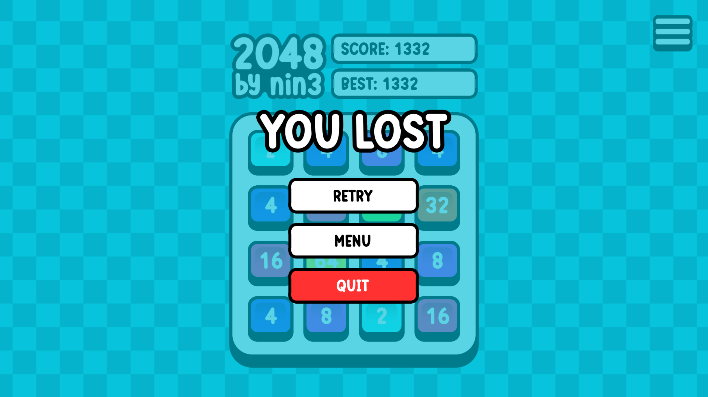

# 2048 🏄‍♂️

## Description

This is my second Unity project, a recreation of the popular game 2048. The game involves merging tiles with the same number to reach the 2048 tile.

## Features

- Interactive gameplay
- Leaderboard system
- Full menu navigation

## How to play

- Use the arrow keys to move the tiles.
- Merge tiles with the same number to increase their value.
- Reach the 2048 tile to win the game or carry on until you lose.

## Where to play

The game is playable in the browser at: [https://therealnin3.itch.io/dynamic2048](https://therealnin3.itch.io/dynamic2048)

## Screenshots

## What I've learned and will improve in the future

During the development of this project, I have learned several key concepts in Unity, including:

- Creating animations to enhance the visual appeal of the game.
- Designing and implementing an interactive user interface (UI) for a seamless gaming experience.
- Understanding how game objects interact with each other through scripting.
- Implementing a menu flow to provide a smooth navigation experience for players.
- Exploring multithreading techniques to optimize performance and handle complex tasks.
- Adding an online leaderboard system to track and display high scores.

In the future, I plan to further improve these aspects and explore more advanced Unity features to enhance the gameplay and overall experience.
